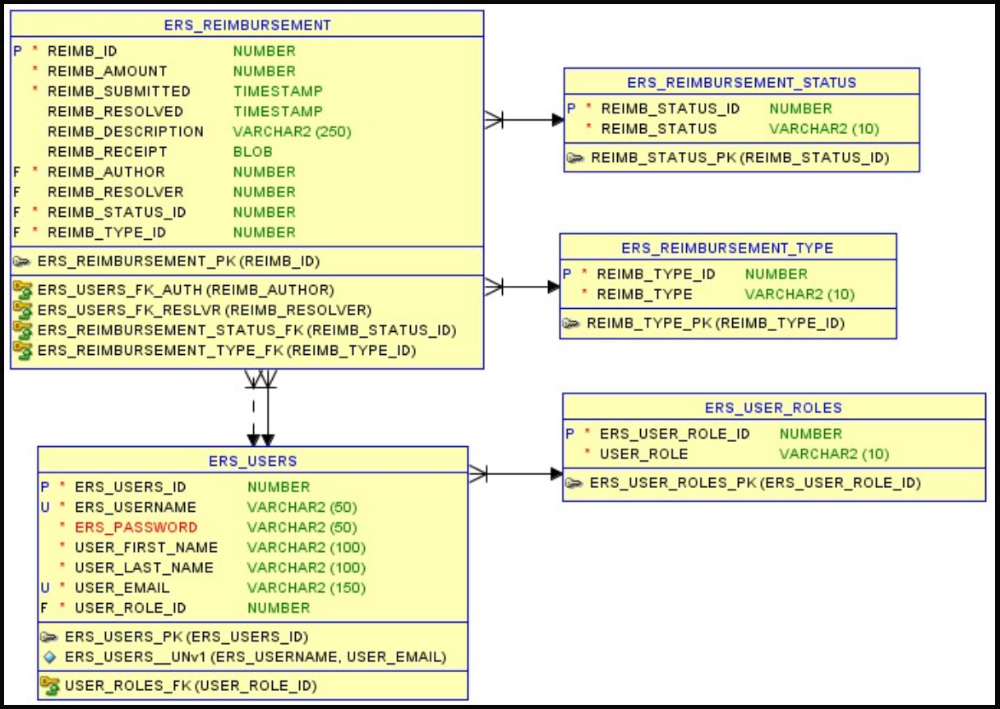

# Expense Reimbursement System [ERS]

A RESTful web application that enables employees to submit expense reimbursement requests and allows financial managers to approve or deny them. Built with Java, Javalin, and PostgreSQL.

[](https://www.youtube.com/watch?v=t2p_fUak_Mw "Expense Reimbursement System")

## Features

✅ **User Management**

- User registration and authentication
- JWT-based session management
- Role-based access control (Employee/Manager)

✅ **Expense Reimbursement**

- Submit expense requests with cost and description
- View submitted requests by user
- Filter requests by status (Pending/Approved/Denied)
- Manager approval/denial workflow

✅ **Data Persistence**

- PostgreSQL database integration
- JDBC connection management
- Comprehensive data models

## Tech Stack

✅ **Java 8** - Core programming language  
✅ **Apache Maven** - Build automation and dependency management  
✅ **PostgreSQL** - Relational database  
✅ **Javalin 5.0.1** - Lightweight web framework  
✅ **Jackson** - JSON serialization/deserialization  
✅ **JWT** - Token-based authentication  
✅ **SLF4J/Logback** - Logging framework  
✅ **JUnit/Mockito** - Testing framework  

## API Endpoints

### Users

- `POST /users/register` - Register new user
- `POST /users/login` - User authentication
- `POST /users/logout` - User logout
- `GET /users/{id}` - Get user by ID
- `PUT /users/{id}` - Update user
- `DELETE /users/{id}` - Delete user

### Tickets

- `POST /tickets/submit` - Submit new expense request
- `GET /tickets/{id}` - Get ticket by ID
- `GET /lister/{author}` - Get tickets by author
- `GET /lister` - Get all tickets
- `GET /list/{status}` - Get tickets by status
- `PUT /tickets/{id}` - Approve/deny ticket

## Project Architecture

The application follows a layered architecture pattern:

- **Controllers** - Handle HTTP requests and responses
- **Services** - Business logic implementation
- **DAOs** - Data access layer with PostgreSQL integration
- **Models** - Domain objects (User, Ticket, Receipt, LoginTemplate)
- **Utils** - Database connection utilities

## Getting Started

1. **Prerequisites**
   - Java 8+
   - Maven 3.6+
   - PostgreSQL 12+

2. **Database Setup**
   - Create PostgreSQL database
   - Configure connection in `JDBCConnectionUtil.java`

3. **Build and Run**

   ```bash
   mvn clean install
   java -jar target/aj_barea_p1-0.0.1-SNAPSHOT.jar
   ```

4. **Access Application**
   - Server runs on `http://localhost:9000`
   - Test endpoint: `GET /test`

## Database Models

### State-chart Diagram


### Logical Model


### Physical Model



### Activity Diagram


## User Stories & Acceptance Criteria

### Employee Features

- ✅ Secure login with username/password
- ✅ User registration with unique username validation
- ✅ Default non-administrative role assignment
- ✅ Submit requests with cost and description
- ✅ View previously submitted reimbursements

### Manager Features  

- ✅ Process employee reimbursement requests
- ✅ Tickets default to 'Pending' status
- ✅ Approve or deny pending requests
- ✅ Immutable status after processing

## Testing

Run unit tests with Maven:

```bash
mvn test
```
